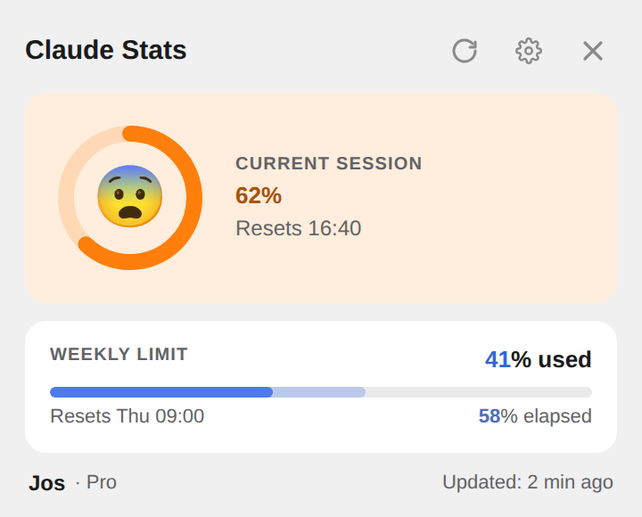
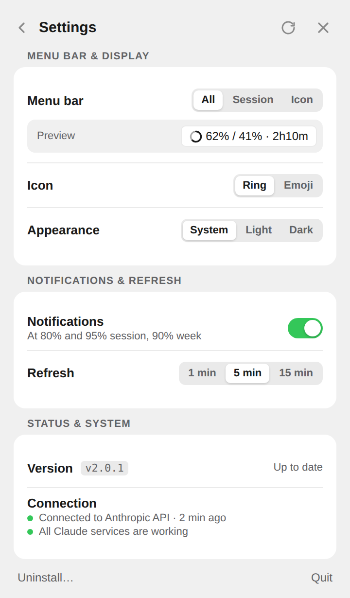

_The popover. The menu bar shows the same information in one line._

## The Challenge

A Claude plan has two limits: a five-hour session window and a weekly cap. Both are visible, but only on a settings page in claude.ai. So you find out you are close to a limit when you are already there, usually halfway through a task.

The question I wanted answered wasn't _"what percentage am I at?"_ It was _"can I keep going?"_ That is a different question, and it leads to a different design.

## My Role

This is a personal project. I built it with Claude Code, in four focused days spread over two months. The code was largely written by Claude. What it should do, what it shouldn't do, and when something was good enough were my decisions: the product, the interaction design, the copy, and every trade-off along the way.

## Approach

**Designed for a glance.** The menu bar title is the product. Everything else is detail. It reads like this:

`😨 62% / 41% · 2h10m`

| 🚀  | 🙂  | 😅  | 😨  | 😰  | 😱  | 💀   |
| --- | --- | --- | --- | --- | --- | ---- |
| 0%  | 20% | 40% | 60% | 75% | 90% | 100% |

Session usage, weekly usage, and the time until the session resets. The face in front does the real work: you don't read it, you notice it. A rocket means go. A skull means wait for the reset. For people who find that too playful there is a monochrome ring that fills up and only takes on colour from 75%. Keeping that one line accurate mattered more than anything else. At one point I let macOS throttle the app to save energy, and refreshes stretched from five minutes to nine. I reversed that: an energy saving that makes the menu bar wrong defeats the point of the app.

**A percentage needs a clock.** _41% used_ tells you very little on its own. On day two of the week that is a lot. On day six it is nothing. So the weekly bar has two fills: a light one for how much of the week has passed, and the usage in front of it. If usage runs ahead of time, you are spending faster than the week allows. The number became a rate instead of a level, without adding a chart, an extra screen or a single new word to learn.

**Interrupt only when it matters.** Notifications come at 80% and 95% of the session and at 90% of the week, each sent once per window. When a limit resets, the app only says so if it warned you before. A reset you didn't know you were waiting for is noise.

_Settings live behind the gear. Problems surface on the main view as a dot on that gear._

**Small things that make it feel calm.** The popover is anchored to the menu bar title, so the title doesn't change while the popover is open: nothing moves under your cursor. The main view shows usage and nothing else; a connection problem, a Claude outage or an available update shows up as a dot on the gear. The stress-coloured percentage failed contrast on its own tinted card, so its colour is stepped towards black or white until it passes WCAG AA, checked at every percentage in both themes. If the app doesn't recognise a plan, it shows no plan name instead of a likely one. And new installs get the ring icon, while existing users keep the emoji they already had: nothing changes silently.

**Trust as a feature.** The app reads usage with the session of the Claude desktop app that is already signed in. Nothing goes to anyone else, and usage history stays on your Mac. Updates are signed, and the app rejects any update without a valid signature. None of this shows on screen. It is still the part I would defend first.

**Rewriting it without changing it.** Version 1 was a Python app; version 2 is a native Swift rewrite that should look identical from the outside. The Python version stayed in the repository as the reference: the same inputs go into both, and the Swift version has to produce exactly the same output, down to how a colour is rounded.

## Impact

Claude Stats is released and open source, in English and Dutch, for Apple Silicon and Intel Macs. The rewrite made it much lighter: the first version loaded claude.ai in a hidden browser to fetch the numbers, peaking at around 400 MB of memory, while version 2 asks for the same data directly. Existing users moved to version 2 through the normal in-app update, with their settings and history intact.

## Learnings

The most useful design decision was reframing the question, from _"how much have I used?"_ to _"can I keep going?"_ Almost every other choice followed from it: a face over a number, a clock next to a percentage, silence over another notification.

It also showed me what working with AI does to the job. When the code is no longer the bottleneck, judgement is what's left: knowing what to build, and when to stop. I wrote about that in [Judgement as a learnable skill](/notes/judgement-as-a-learnable-skill). This project is what it looks like in practice.
